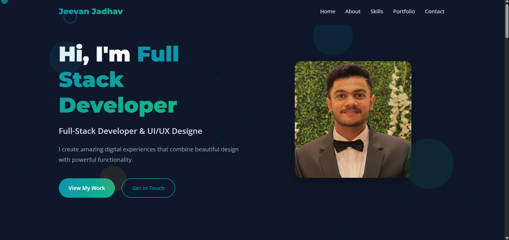
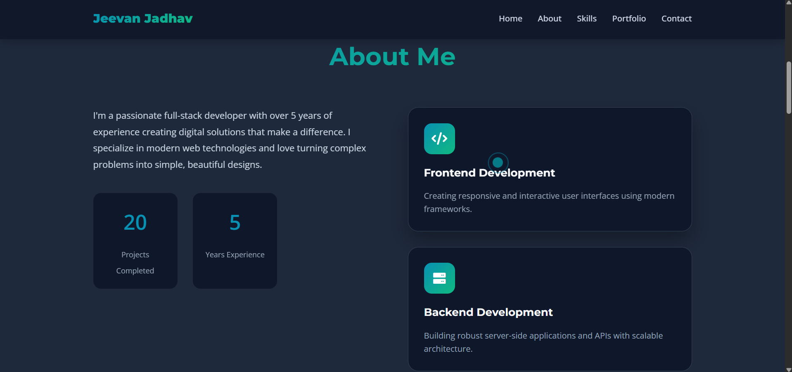

# Portfolio Template (Portfolio-Template-2)

A clean, single-page portfolio template built with **HTML**, **CSS**, and **JavaScript** — ready to edit and drop into your personal site or GitHub Pages.
This repo contains a simple, static one-page website (Portfolio2.html) plus its styles, script and sample images. ([GitHub][1])

---

# About

This is a minimal portfolio template — a single HTML page (`Portfolio2.html`) styled by `style2.css` and powered by small client-side interactions in `script2.js`. The repo includes sample images (e.g. `Jeevan.jpg`, `Zhongli.jpg`, `bg.jpg`) and screenshots for reference. Use it as a starting point for your personal portfolio or to learn how a simple static site is structured. ([GitHub][1])

---

# Screenshots





---

# Features

* Single-page layout (hero / about / projects / contact sections)
* Responsive CSS (desktop → mobile)
* Simple JavaScript for interactivity (menu, scroll effects, etc.)
* Easy to customize — swap images and update content

---

A quick mapping:

* `Portfolio2.html` — main HTML file containing the whole page. 
* `style2.css` — all page styles.
* `script2.js` — small JS interactions used by the template.
* `*.jpg` / `*.png` — sample images and screenshots used by the page.
* `LICENSE` — MIT License.

---

# How to run locally

This is a static site — no build tools required. Two easy ways:

**1) Open directly (quick)**

* Double-click `Portfolio2.html` in your file manager or open it in the browser (`File -> Open File`) — works for quick previews.

**2) Serve with a local HTTP server (recommended for any JS that expects an HTTP origin)**

* With Python 3:

```bash
# from the repository folder
python3 -m http.server 8000
# then open http://localhost:8000/Portfolio2.html
```

* With Node (if you prefer):

```bash
# install a static server if you have npm (optional)
npx serve .
# or
npm install -g http-server
http-server .
```

---

# Deploying (quick)

**GitHub Pages**

1. Push this repo to GitHub.
2. In the repository's **Settings → Pages**, select the branch (e.g., `main`) and root folder `/` (or `gh-pages` branch) then save.
3. Your site will be served at `https://<your-username>.github.io/<repo-name>/Portfolio2.html` (or the repo root if you rename `Portfolio2.html` to `index.html`).

**Other hosting**

* You can deploy to any static hosting: Netlify, Vercel (static), Surge.sh, Firebase Hosting, etc. If you want the repo root to serve as the site entry, rename `Portfolio2.html` → `index.html`.

---

# Customize

A short checklist for quick customization:

* Replace images in the repo (e.g., `Jeevan.jpg`) and update `` references in `Portfolio2.html`.
* Edit textual content (name, about, skills, project descriptions) directly in `Portfolio2.html`.
* Tweak design by editing `style2.css` (fonts, colors, spacing).
* Add/modify interactions inside `script2.js` (menu toggle, scroll animations, project modal, etc.).
* To change the main entry point URL when deploying, rename `Portfolio2.html` to `index.html`.

---

# Tips & troubleshooting

* If CSS changes don’t show: clear browser cache or open with a hard refresh (Ctrl+F5).
* If images do not display when opened via `file://`, use the local server method above. Some browsers restrict certain JS/CSS behaviors for `file://` origin.
* If you run into `npx` or `docker` not recognized errors on Windows, it means Node.js / Docker are not installed or not in PATH — you don't need them for this static site (Python http.server is an easy alternative).

---

# Contributing

This is a small template — contributions are welcome. Suggested improvements:

* Convert to a proper multi-file project with separate assets folder (e.g., `assets/img`, `assets/css`, `assets/js`)
* Add a build toolchain (optional) with minification, autoprefixer, and live-reload
* Add a README screenshot embed (update this README with real preview images)

If you'd like, open a PR or issue with suggested changes.

---

# License & credits

This repository is licensed under the **MIT License**.

---

# Contact

If you want the README to include your real name, portfolio link, or email address, replace the placeholders below:

* Author: `Jeevan Jadhav`
* Email: `jeevanj020604@gmail.com`
* GitHub: `https://github.com/NOVA0206` (repo owner) — view files and screenshots in the repository. 

Happy Coding!!!!1
